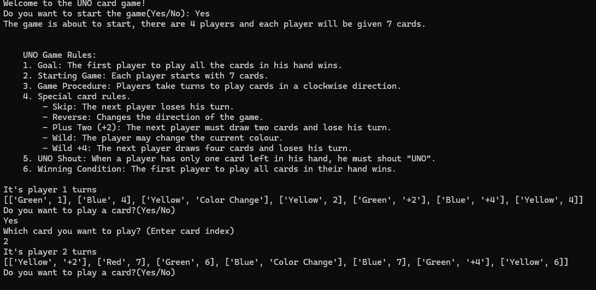

# UNO Card Game (Python)


# Game Screenshot



---

## Project Information

Course: ICS3U  
Project: Final Programming Project  
Authors: Isaac & Megan  
Date: Jan 8 – Jan 23, 2024  

This project is a **console-based UNO card game implemented in Python**.

The game simulates a simplified UNO game where four players take turns playing cards according to UNO rules.

---

# Project Description

The goal of this project is to simulate the mechanics of the UNO card game using Python.

The program includes card generation, shuffling, dealing cards to players, handling player turns, and applying special card effects.

The game continues until one player plays all their cards and wins.

---

# Features Implemented

The program includes the following features:

- Full UNO card deck generation
- Card shuffling
- Dealing cards to players
- Turn-based gameplay
- Drawing cards from the deck
- Special card effects
- UNO rule implementation
- Win condition detection

---

# Special Cards

| Card | Effect |
|-----|------|
| Skip | The next player loses their turn |
| Reverse | Reverses the order of players |
| +2 | The next player draws two cards |
| +4 | The next player draws four cards |
| Color Change | Allows the player to change the current color |

---

# Game Rules

1. Each player starts with **7 cards**.
2. Players take turns playing cards.
3. A card can be played if:
   - The color matches the top card
   - The card type matches
   - The card is a wild card
4. Special cards apply their effects to the next player.
5. When a player has **one card left**, they must call **UNO**.
6. The first player to play all cards wins the game.

---

# Program Structure

The project contains several functions responsible for different parts of the game.

Main functions include:

| Function | Description |
|--------|-------------|
| `create_total_cards()` | Generates the full UNO card deck |
| `draw_card()` | Draws cards from the deck |
| `deal_hand()` | Deals cards to players |
| `play_card()` | Handles player turns and card selection |
| `c_plus_2()` | Implements +2 card effect |
| `c_plus_4()` | Implements +4 card effect |
| `reverse_card()` | Reverses player order |
| `uno()` | Handles the UNO rule when a player wins |

---

# How to Run the Program

### Step 1

Install Python 3.

### Step 2

Download the project files.

### Step 3

Run the program using:

```bash
python uno_game.py
```

---

# Project Structure

```
UNO-Card-Game-Python
│
├── README.md
├── uno_game.py
├── result.png
├── daily_log.docx
├── project_report.pdf
```

---

# Development Process

The project was developed over several stages:

1. Determining the project topic
2. Dividing responsibilities between team members
3. Implementing player turn logic
4. Implementing special card effects
5. Building the main game loop
6. Debugging and testing the program

The full development record is available in **daily_log.docx**.

---

# Technologies Used

- Python
- Random module
- Console input/output

---

# Learning Outcomes

Through this project we learned:

- how to design a game using functions
- how to structure a multi-function Python program
- how to manage game state
- how to debug Python programs
- how to organize a project using GitHub

---

# License

This project was developed as part of the **ICS3U final programming project** for educational purposes.
